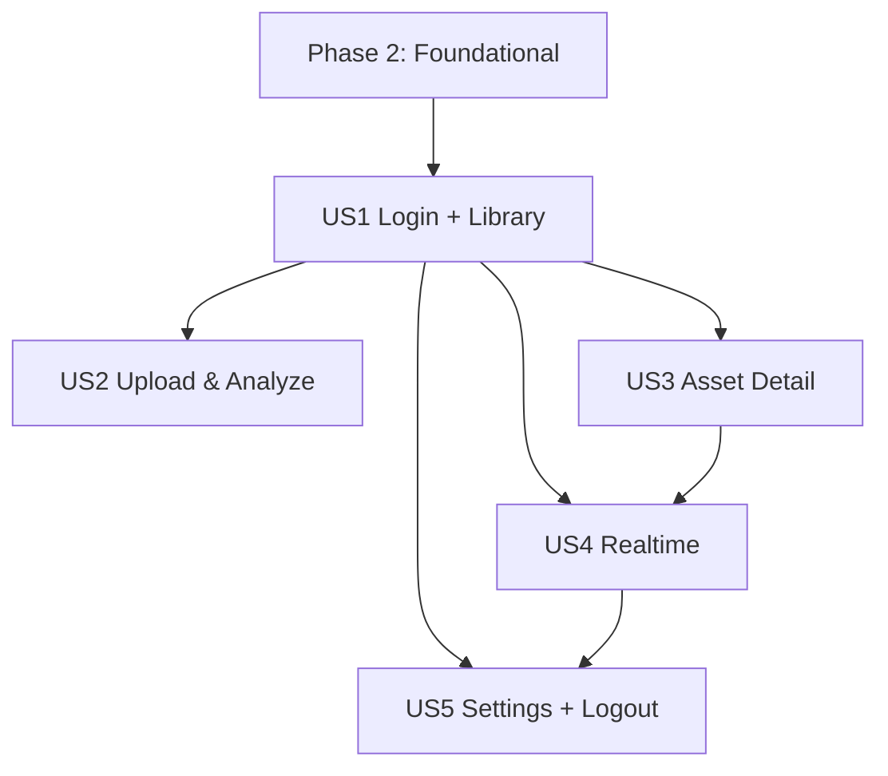

---

description: "Task list for feature implementation"
---

# Tasks: Mobile UX Parity (Web → Mobile)

**Input**: Design documents from `/specs/011-mobile-ux-parity/`

**Prerequisites**: [plan.md](plan.md) (required), [spec.md](spec.md) (required), [research.md](research.md), [data-model.md](data-model.md), [contracts/](contracts/)

**Tests**: Tests are MANDATORY per Constitution principle III (Test-First). Write tests FIRST; they MUST fail before implementation.

**Organization**: Tasks are grouped by user story to enable independent implementation and testing of each story.

## Phase 1: Setup (Shared Infrastructure)

**Purpose**: Project initialization and basic structure for the Expo mobile app and shared utilities.

- [X] T001 Create mobile feature folder skeleton in mobile/src/{api,components,config,contexts,hooks,navigation,screens,services,styles,types,utils}
- [X] T002 [P] Add mobile TypeScript config (if adopting TS) in mobile/tsconfig.json and align imports/paths (SKIPPED - using JS)
- [X] T003 [P] Add React Navigation dependencies in mobile/package.json and install (bottom tabs + native stack)
- [X] T004 [P] Add secure token storage dependency for mobile in mobile/package.json (e.g., Expo SecureStore) and install
- [X] T005 [P] Add mobile test tooling (Jest + React Native Testing Library) and config in mobile/jest.config.js and mobile/package.json scripts
- [X] T006 Update mobile/App.js to mount providers + navigation root (temporary placeholder screens ok)

---

## Phase 2: Foundational (Blocking Prerequisites)

**Purpose**: Core infrastructure that MUST be complete before ANY user story can be implemented.

- [X] T007 Implement design tokens/theme module in mobile/src/styles/tokens.ts (mirror semantics from web/src/index.css)
- [X] T008 [P] Implement status mapping utility in mobile/src/utils/statusDisplay.ts (match label semantics from web/src/lib/status-display.ts)
- [X] T009 [P] Implement Toast system in mobile/src/contexts/ToastContext.tsx + mobile/src/components/ui/ToastHost.tsx (success/info auto-dismiss; errors persist)
- [X] T010 [P] Implement network connectivity tracking and OfflineBanner in mobile/src/hooks/useNetworkStatus.ts + mobile/src/components/ui/OfflineBanner.tsx
- [X] T011 Implement API client wrapper with 401 refresh queue in mobile/src/services/apiClient.ts (send X-Client-Platform: mobile; refresh returns accessToken only)
- [X] T012 Implement secure token persistence helpers in mobile/src/services/tokenStore.ts (access token + refresh token; clear on logout)
- [X] T013 Implement AuthContext in mobile/src/contexts/AuthContext.tsx (login/register/logout + silent refresh integration)
- [X] T014 Implement SocketService in mobile/src/services/socketService.ts (socket.io-client; handshake.auth.token)
- [X] T015 Implement SocketContext in mobile/src/contexts/SocketContext.tsx (connection state + reconnecting banner)
- [X] T016 Implement navigation scaffold (Auth stack + Tabs + detail stack) in mobile/src/navigation/{RootNavigator.tsx,TabsNavigator.tsx,AuthStack.tsx,AppStack.tsx}

- [X] T017 [P] Add contract test coverage for status filter enums in server/tests/contract/assets/assets-status-filter.test.js (GET /api/assets?status=failed|partial should not 400)
- [X] T018 Align status validation enums to Asset model in server/src/modules/assets/assets.routes.js (listAssetsValidation + create/update status enums include draft|processing|partial|active|archived|failed)
- [X] T019 [P] Amend OpenAPI contract enum for status filter in specs/001-foundation-backend-setup/contracts/assets.openapi.json (include partial + failed)

**Checkpoint**: Foundation ready — US1–US5 work can begin.

---

## Phase 3: User Story 1 - Login → Assets Library (Priority: P1) 🎯 MVP

**Goal**: User logs in and lands on Assets Library with skeleton loading, correct status pills, filters, infinite scroll, and automatic token refresh on expiry.

**Independent Test**: With a mocked API (and/or a test backend user), user can log in, see a loading skeleton, then see asset cards with correct status pills; filters and infinite scroll work; 401 triggers refresh and retries.

### Tests for User Story 1 (MANDATORY, write first) ⚠️

- [X] T020 [P] [US1] Unit test status mapping in mobile/src/utils/statusDisplay.test.ts (active→Ready, colors consistent)
- [X] T021 [P] [US1] Unit test apiClient 401 refresh queue in mobile/src/services/apiClient.test.ts (single refresh, queued retries)
- [X] T022 [P] [US1] Unit test AuthContext flows in mobile/src/contexts/AuthContext.test.tsx (login/logout + token persistence)
- [X] T023 [P] [US1] Component test LoginScreen form validation in mobile/src/screens/auth/LoginScreen.test.tsx
- [X] T024 [P] [US1] Component test Library skeleton→list rendering in mobile/src/screens/assets/AssetsLibraryScreen.test.tsx (mock loading then data)

### Implementation for User Story 1

- [X] T025 [P] [US1] Implement StatusPill component in mobile/src/components/ui/StatusPill.tsx (uses statusDisplay mapping)
- [X] T026 [P] [US1] Implement Skeleton components for cards/list in mobile/src/components/ui/Skeleton.tsx
- [X] T027 [P] [US1] Implement Input/Button primitives with accessible labels in mobile/src/components/ui/{Button.tsx,Input.tsx}
- [X] T028 [US1] Implement LoginScreen in mobile/src/screens/auth/LoginScreen.tsx (calls AuthContext.login; error toast persists)
- [X] T029 [US1] Implement RegisterScreen in mobile/src/screens/auth/RegisterScreen.tsx (calls AuthContext.register)
- [X] T030 [P] [US1] Implement assets API wrapper (list) in mobile/src/api/assetsApi.ts (cursor pagination; limit/category/status)
- [X] T031 [P] [US1] Implement assets list hook with infinite scroll in mobile/src/hooks/useInfiniteAssets.ts (cursor nextCursor; debounced search)
- [X] T032 [US1] Implement AssetsLibraryScreen in mobile/src/screens/assets/AssetsLibraryScreen.tsx (grid/list; skeleton; status pills; load-more)
- [X] T033 [US1] Implement Filters bottom sheet + active chips in mobile/src/components/assets/AssetFiltersSheet.tsx and integrate into AssetsLibraryScreen
- [X] T034 [US1] Add token-expiry handling: when 401 occurs, refresh automatically and retry in mobile/src/services/apiClient.ts

**Checkpoint**: US1 is independently demoable.

---

## Phase 4: User Story 2 - Upload & Analyze (Priority: P2)

**Goal**: User selects image (camera/gallery) + category, Submit becomes enabled, submit uploads multipart, then navigates to Asset Detail in Processing state; oversized/invalid file shows error.

**Independent Test**: From Upload tab, user can pick an image, choose a category, submit successfully, and see Processing detail without crash; invalid file triggers clear error.

### Tests for User Story 2 (MANDATORY, write first) ⚠️

- [X] T035 [P] [US2] Unit test upload validation (type/size <=10MB) in mobile/src/utils/uploadValidation.test.ts
- [X] T036 [P] [US2] Component test Submit enabled rules in mobile/src/screens/upload/UploadScreen.test.tsx
- [X] T037 [P] [US2] Component test upload-abandon confirm behavior in mobile/src/screens/upload/UploadScreen.navigation.test.tsx

### Implementation for User Story 2

- [X] T038 [P] [US2] Implement upload validation utility in mobile/src/utils/uploadValidation.ts (size <= 10MB; accepted image mime types)
- [X] T039 [P] [US2] Implement camera/gallery picker wrapper in mobile/src/services/imagePicker.ts (expo-camera + expo-image-picker)
- [X] T040 [P] [US2] Implement Upload API wrapper in mobile/src/api/uploadApi.ts (POST /api/assets/analyze-queue multipart)
- [X] T041 [US2] Implement UploadScreen UI in mobile/src/screens/upload/UploadScreen.tsx (bottom-sheet camera/gallery; category select; thumb-zone Submit)
- [X] T042 [US2] Implement navigation to AssetDetail on successful submit in mobile/src/navigation/AppStack.tsx (route params include assetId)
- [X] T043 [US2] Add confirm-on-leave logic during active upload in mobile/src/screens/upload/UploadScreen.tsx

**Checkpoint**: US2 is independently demoable.

---

## Phase 5: User Story 3 - Asset Detail + Toggle (Priority: P3)

**Goal**: Asset Detail renders per status (Ready/Processing/Failed/Partial/Archived), supports Processed/Original toggle, shows AI analysis + condition + metadata, supports Retry on failed, and Archive.

**Independent Test**: With mocked assets in each status, the detail UI renders correctly; toggle swaps image; retry triggers processing; archive updates status.

### Tests for User Story 3 (MANDATORY, write first) ⚠️

- [X] T044 [P] [US3] Component test status-based rendering in mobile/src/screens/assets/AssetDetailScreen.test.tsx (ready/processing/failed/partial)
- [X] T045 [P] [US3] Component test Processed/Original toggle swaps image in mobile/src/components/assets/ImageToggle.test.tsx
- [X] T046 [P] [US3] Contract test stub for retry endpoint in server/tests/contract/assets/retry.test.js (expected 202 + status=processing)

### Implementation for User Story 3

- [X] T047 [P] [US3] Implement asset detail API wrapper in mobile/src/api/assetsApi.ts (GET /api/assets/:id)
- [X] T048 [P] [US3] Implement AssetDetail data hook in mobile/src/hooks/useAsset.ts (polling optional; realtime in US4)
- [X] T049 [P] [US3] Implement ImageToggle component in mobile/src/components/assets/ImageToggle.tsx (processed/original)
- [X] T050 [P] [US3] Implement ProcessingOverlay component in mobile/src/components/assets/ProcessingOverlay.tsx
- [X] T051 [US3] Implement AssetDetailScreen in mobile/src/screens/assets/AssetDetailScreen.tsx (cards/accordions; status-specific UI)
- [X] T052 [US3] Implement Archive action (API PATCH) in mobile/src/api/assetsApi.ts and wire confirmation in AssetDetailScreen
- [X] T053 [US3] Implement Retry action in mobile/src/api/assetsApi.ts calling POST /api/assets/:id/retry and wire to Failed state CTA

### Backend amendments required for US3

- [X] T054 [US3] Add POST /api/assets/:id/retry route validation in server/src/modules/assets/assets.routes.js
- [X] T055 [US3] Implement retry controller method in server/src/modules/assets/assets.controller.js
- [X] T056 [US3] Implement retry service logic in server/src/modules/assets/assets.service.js (enqueue job; set status=processing; reject non-retryable states with 409)

**Checkpoint**: US3 is independently demoable.

---

## Phase 6: User Story 4 - Realtime (Priority: P4)

**Goal**: Library and Detail update automatically from socket events; reconnecting banner appears on disconnect and auto-reconnects; debounced/merged updates prevent UI thrash.

**Independent Test**: With a simulated `asset_processed` event, the UI updates without manual refresh; disconnect shows reconnecting banner and recovers.

### Tests for User Story 4 (MANDATORY, write first) ⚠️

- [X] T057 [P] [US4] Unit test socket event handler updates asset cache in mobile/src/services/socketService.test.ts
- [X] T058 [P] [US4] Component test reconnecting banner behavior in mobile/src/components/ui/ReconnectingBanner.test.tsx
- [X] T059 [P] [US4] Unit test burst-event debounce/merge in mobile/src/utils/realtimeMerge.test.ts

### Implementation for User Story 4

- [X] T060 [P] [US4] Implement ReconnectingBanner UI in mobile/src/components/ui/ReconnectingBanner.tsx
- [X] T061 [US4] Wire SocketContext to show reconnecting banner and expose connection state in mobile/src/contexts/SocketContext.tsx
- [X] T062 [P] [US4] Implement asset update merge/debounce helper in mobile/src/utils/realtimeMerge.ts
- [X] T063 [US4] On `asset_processed`, update AssetsLibraryScreen state/list in mobile/src/screens/assets/AssetsLibraryScreen.tsx
- [X] T064 [US4] On `asset_processed`, update AssetDetailScreen state in mobile/src/screens/assets/AssetDetailScreen.tsx
- [X] T065 [US4] Implement manual reconnect control (after threshold) in mobile/src/contexts/SocketContext.tsx and surface in Settings

**Checkpoint**: US4 is independently demoable.

---

## Phase 7: User Story 5 - Settings & Logout (Priority: P5)

**Goal**: Settings shows user email + realtime connection state, and logout clears session and returns to login.

**Independent Test**: Navigate to Settings, verify email + connection status, and logout to return to Login with cleared tokens.

### Tests for User Story 5 (MANDATORY, write first) ⚠️

- [X] T066 [P] [US5] Component test Settings shows email + socket state in mobile/src/screens/settings/SettingsScreen.test.tsx
- [X] T067 [P] [US5] Component test Logout clears tokens and resets nav in mobile/src/contexts/AuthContext.logout.test.tsx

### Implementation for User Story 5

- [X] T068 [US5] Implement SettingsScreen in mobile/src/screens/settings/SettingsScreen.tsx (email + socket state)
- [X] T069 [US5] Wire Logout button to AuthContext.logout and reset navigation in mobile/src/navigation/RootNavigator.tsx

**Checkpoint**: US5 is independently demoable.

---

## Phase 8: Polish & Cross-Cutting Concerns

- [X] T070 [P] Add accessibility audit pass (labels, focus order, 44pt targets) across mobile/src/screens/**
- [X] T071 Reduce toast spam on offline→online and reconnect transitions in mobile/src/contexts/ToastContext.tsx
- [X] T072 Performance pass: memoize card renders + optimize FlatList props in mobile/src/screens/assets/AssetsLibraryScreen.tsx
- [X] T073 [P] Update documentation links and commands in specs/011-mobile-ux-parity/quickstart.md to match actual scripts
- [X] T074 Run quickstart verification checklist end-to-end on device/emulator (record any gaps as follow-up tasks)

---

## Dependencies & Execution Order

### User Story Completion Order

- Phase 1 → Phase 2 (blocking)
- Then implement stories in priority order: **US1 → US2 → US3 → US4 → US5**

### Story Dependencies

- **US1** depends on Phase 2 only.
- **US2** depends on US1 (authenticated user + API client).
- **US3** depends on US1 (auth) and minimal assets API wrappers.
- **US4** depends on US1 (auth token for socket) and should integrate with US1/US3.
- **US5** depends on US1 (auth state) and US4 (socket state display).

---

## Dependency Graph (User Stories)

---

## Parallel Execution Examples (per Story)

### US1 Parallel Examples

- [P] T022 (StatusPill) + T023 (Skeleton) + T024 (UI primitives) can be done in parallel.
- [P] T027 (assets API wrapper) + T028 (infinite hook) can be done in parallel.

### US3 Parallel Examples

- [P] T046 (ImageToggle) + T047 (ProcessingOverlay) can be done in parallel.
- Backend: [P] T051 (route) can be done alongside mobile T044/T048 as long as contract is fixed.

### US4 Parallel Examples

- [P] T057 (banner UI) + T059 (merge helper) can be done in parallel.

---

## Implementation Strategy

### MVP First

1) Complete Phase 1 + Phase 2
2) Complete US1 (Login → Library) and stop to validate independently

### Incremental Delivery

- Add US2, validate upload flow end-to-end
- Add US3, validate detail states and retry/archive
- Add US4, validate realtime update + reconnect UX
- Add US5, validate settings + logout

---

## Notes

- All tasks follow the required checklist format: `- [ ] T### [P?] [US#?] Description with file path`.
- `[P]` indicates safe parallel work on different files without ordering dependencies.
- Contract amendments are explicitly captured in `specs/011-mobile-ux-parity/contracts/`.
